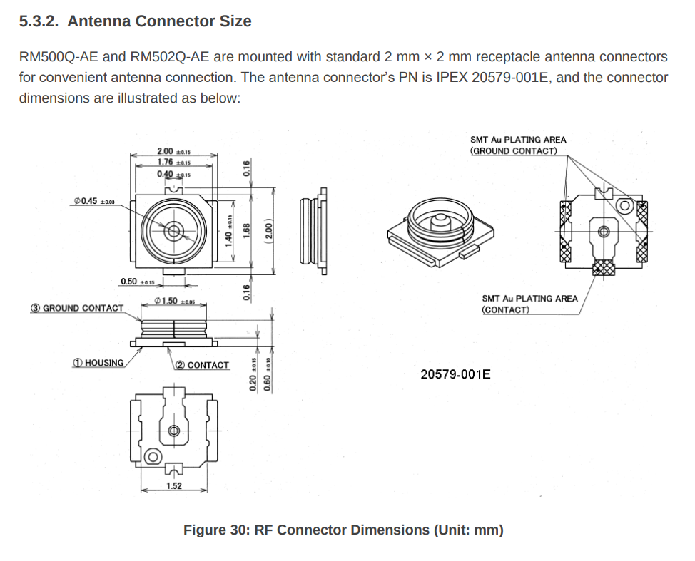

## Meeting Minutes
- Start with wind sensor
	- state of things
		- figure out the bluetooth range (10m minimum)
		- if we need to, maybe switch to wifi
		- figure out what direction the wind sensor needs to face, figure out how to align that in the field
		- connect wind sensor to TAK server
		- get GPS on wind sensor
- ATAK
	- what we've learned
		- need to find some time outside meeting
		- email with tutorial to setup ATAK on phones
	- next steps
		- what do we need in terms of data for ATAK
			- drone
				- altitude, position, windspeed, and direction
				- maybe a windbar? arrow and direction?
				- same thing for other sensors (wind sensor, other things?)
			- plugin interface
				- find in real time the effect of the wind for a firing solution
				- Dr. Myatt has some code that we may be able to implement
		-
- SDR
	- spend a few hours figuring out what modules we will need to eavesdrop on cellphone
	- figure out the main challanges
-
-
- https://www.i-pex.com/product/mhf-4l
- 
- pg 65