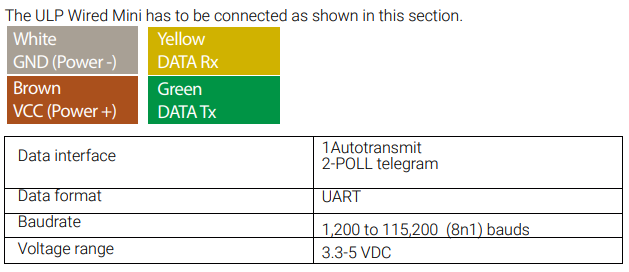

- 
- On the Pi z2w, we will stick to BLE since we will be powering the thing with a battery most likely.
	- Using a battery bank with a micro usb will allow us to power the board
	- we should be able to power the sensor from the 5V pin on the z2w as the 5V rail on the pi does not have current limits (other than trace width)
	- sample rate of 5-10Hz is desirable
	- Digikey order for something (microcontroller, pi z2w, etc...)
	-
	- pi wire colors:
		- | pin # | GPIO # | function | Wire Colour |
		  | 8 | 14 | UART0 TX | orange |
		  | 10 | 15 | UART0 RX | yellow |
		-
	-
- DONE Figure out what battery to use and make sure it will have enough power for transducers
  :LOGBOOK:
  CLOCK: [2026-05-12 Tue 10:17:21]
  CLOCK: [2026-05-12 Tue 10:17:22]--[2026-06-02 Tue 10:11:07] =>  503:53:45
  :END:
-
-
-