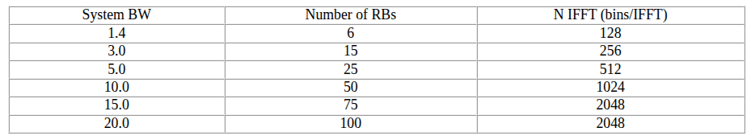

- #LTE #2026USRA
- ## LTE Downlink frame structure:
	- Three types: (based on duplex mode)
		- Type 1: FDD (Frequency Division Duplexing)
			- two different frequency bands, one for uplink and one for downlink
		- Type 2: TDD (Time Division Duplexing)
		- Type 3:  LAA (License-Assisted Access)
	- Subcarrier spacing is 15KHz for all
		- $15kHz * 12 subcarriers = 180 kHz$ Bandwidth for each Resource Block
		-
	- Radio frame contains subframes, which contains slots
		- Radio Frame Length: 10ms
		- Subframe Length: 1ms
	- Each Subframe contains 14 OFDM symbols for normal CP
	- Resource block
		- contains one slot (7 symbols) and 12 subcarriers
- 
-
- The center frequency of each channel is determined by the #EARFCN
- ## Channels
- [[PBCH]]
-